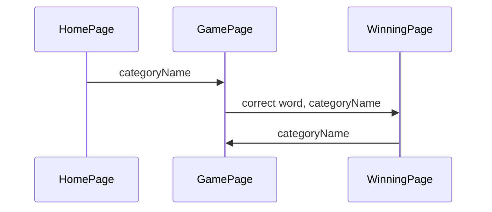
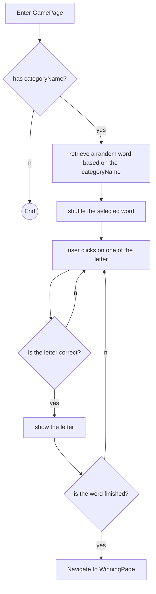

### How the props between pages work

```mermaid
  sequenceDiagram
    HomePage->>GamePage: categoryName
    GamePage->>WinningPage: correct word, categoryName
    WinningPage->>GamePage: categoryName
```

### How does the word guessing works

```mermaid
  flowchart TD
    a[Enter GamePage] --> b{has categoryName?}
    b --no--> e((End))
    b --yes--> d[retrieve a random word based on the categoryName]
    d --> f[shuffle the selected word]
    f --> g[user clicks on one of the letter]
    g --> h{is the letter correct?}
    h --no--> g
    h --yes--> j[show the letter]
    j --> k{is the word finished?}
    k --no--> g
    k --yes--> l[Navigate to WinningPage]
```
